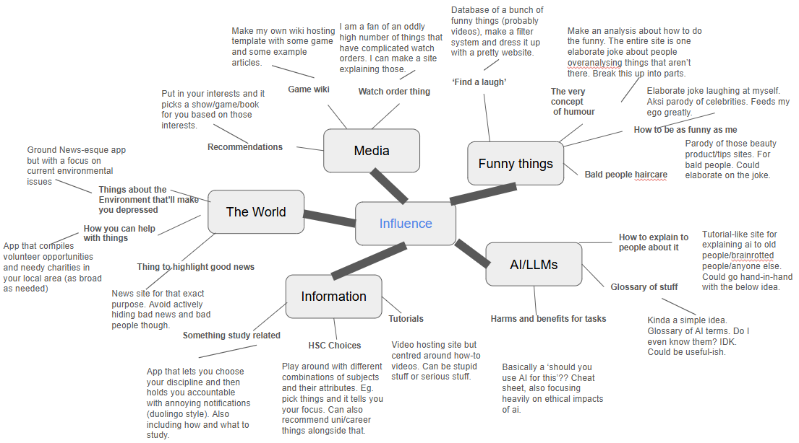
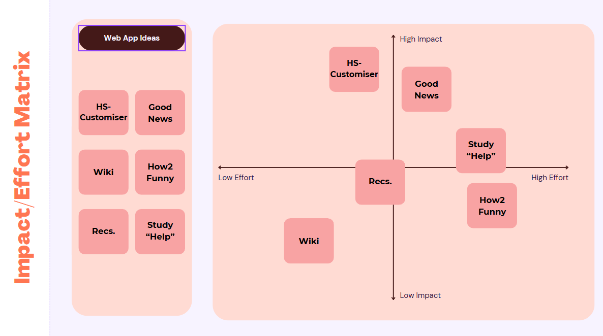
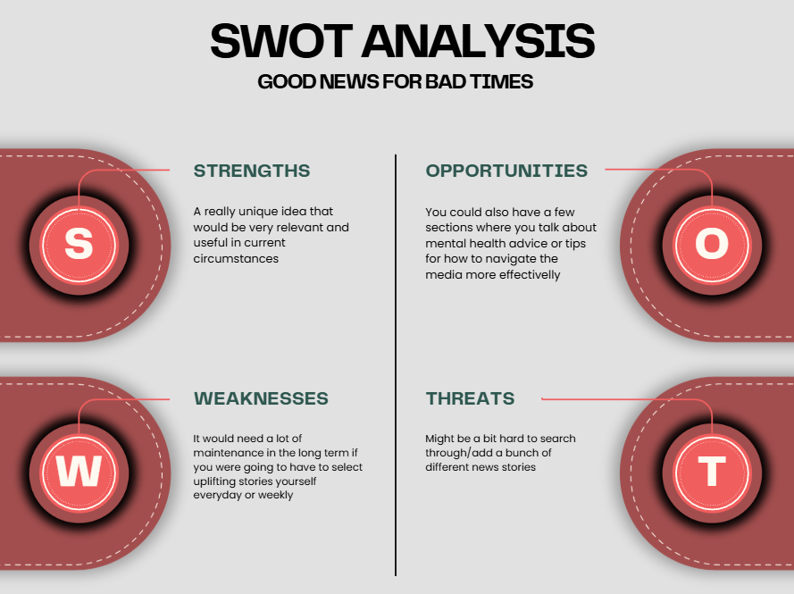
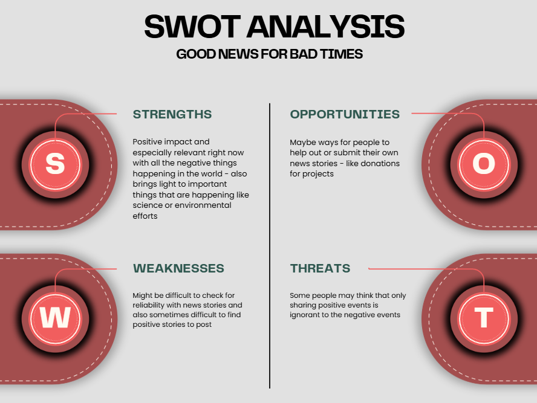
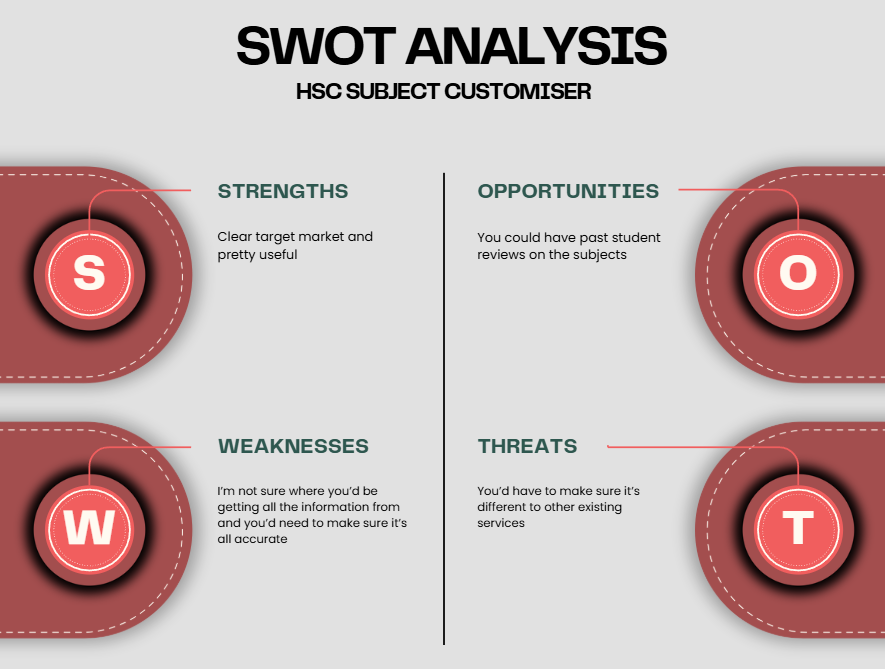
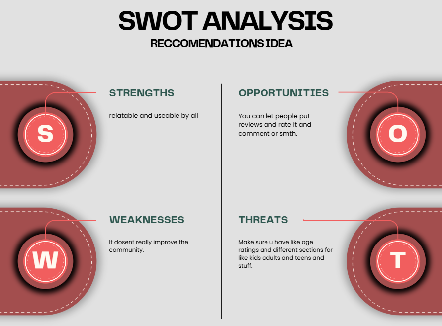
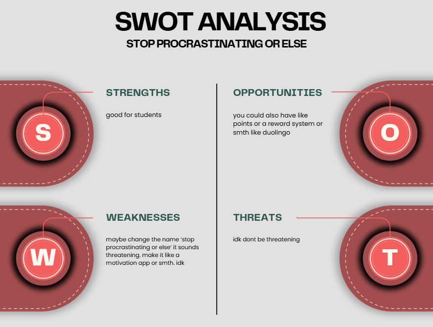
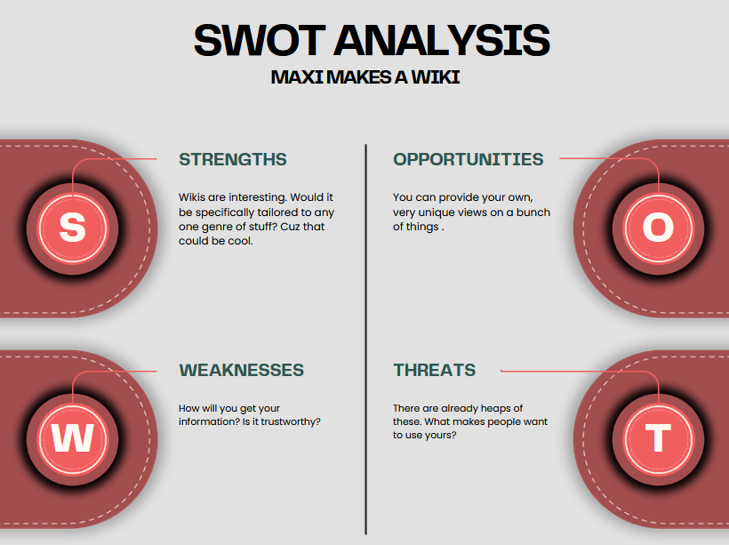

# Markdown Title
# *Identifying and Defining*
## Diverge
### Mindmap

##
| Idea Name | What it does | Influence it explores | Who it Helps |
|-|-|-|-|
| HSC Subject Customiser               | Give values to each HSC subject based off their attributes. You pick a set of subjects and it shows you those values. Also just has general info about subjects. | School/Society, through giving information. Can make things easier or just be fun for experimentation. | High School Students, parents of High School Students. Could be a good resource for Careers.        |
| Good News for Bad Times              | Highlights/writes/links news articles that can generally be considered ‘good’ because we need more of that in Society.                                           | People’s perceptions are heavily based on bad news. Influence through joy.                             | People who are struggling with the suffering of the 21st century.                                   |
| Maxi Makes a Wiki                    | Wiki sites provide information about whatever topic they focus on. I want to try making one myself.                                                              | Media has a large influence on people, and so the topic is what’s influencing.                         | Any internet denizen who wants to know more about their interests.                                  |
| How to be Humorous                   | Satirise the very concept of the app, that is the idea of there being a set way to be funny. Essentially acts as one big joke tutorial.                          | The FUNNIES. Laughter is a uniting force, there’s nobody who doesn’t enjoy it. The concept of humour.  | People who want to be funny, or read something funny, or are funny.                                 |
| Recommendations Idea (title pending) | Contains a database of TV shows (and perhaps movies/games/books as well), and lets you get recommendations by inputting what you like, or filtering through it.  | Interests are the source of many people’s good times. There is power in enjoying things.               | Ever scroll through Netflix and see literally nothing interesting? Use this instead! Show watchers. |
| Stop Procrastinating or Else         | Phone app like Duolingo, though the reminders are the primary feature. Branding is comedically edgy, and it can also have suggestions on what method to do.      | Commit to your darned studying, it’ll help you. So, commitment.                                        | Could theoretically be used by anyone, though geared towards students probably. |
## Converge
### Impact/Effort Matrix

## Swot Analysis
**Good News for Bad Times:**

**HSC Subject Customiser:**

**Reccomendations Idea:**

**Stop Procrastinating:**

**Humour Idea:**

**Wiki Idea:**

I've decided to move forward with the idea of the HSC Customiser as it's a useful, high impact idea with a clear target audience that could use it well. It should be relatively easy to simply use the information on the government sites, and make a good website to host it with some simple code. I and others could use this to either play around with or make serious decisions well.

## Requirements Outline

### Functional Requirements
The website will be able to provide information about subjects, and the primary feature will be a menu containing HSC subjects with some data about them, that users will be able to select and combine to show the features of their overall solutions.

Users can:
* Learn attributes and statistics of different subjects.
* Click to be taken to useful further sources.
* Use the customiser to get information about their HSC selection such as how well rounded it is, what the usual ATARs of the subjects are, and what their focus areas likely are.

### Non-Functional Requirements
* Quality UI
The site must have an easily understandable User Interface that makes it obvious and easy for users to navigate the site and use it's features.

* Aesthetics
The site must be aesthetically pleasing, without excessive contrast or distracting elements. Ideally it should also contain both a light and dark mode.

* Performance
The site should load in a reasonable time, not lagging the user's device with poor optomisation or excessive graphics.

* Factuality
The site should contain entirely factual information, ideally sourced from official sites which can be linked both for referencing and further reading.

# *Researching and Planning*
### Explore Existing Ideas

|Site | Plus | Minus |Implication|
|-|-|-|-|
| The New York Times| The New York Times website's front page greets users with a simple white background, and the black text of several news articles about a variety* of topics. The simple design places focus on the site's content, allowing users to easily jump in to their topic of choice.*About half of topics are related to the US Government. The articles are similar, with the text of the article in a sea of white and little distraction. | Upon entering an article, the site forces users to either sign in or pay to access the article. For regular readers this is irrelevant, but even the former can be inconvenient for some. | The New York Times shows a minimalist design philosophy that can be implemented into my site, as it will be formal and for educational purposes. The Times' low obstructions make it fast and easy to use, letting users get immersed and perhaps influenced by the content, and so  my site should likely be similar in terms of complexity. |
| NSW Curriculum Site| The site's purpose is to inform and so it does so incredibly well, with the syllabus information being organised and easily accessible. Searching for your subject of choice is simple and convenient, and the content has a convenient download feature front and centre when you load into a syllabus. There is an abundance of useful information on the site for both students and educators. |There is an abundance of content and resources sorted into a huge variety of classifications, which makes it difficult to find specific resources if you need to. The site is designed well for accessing new information, but finding something specific can be incredibly difficult. | The scope of my site should be managed as to not become too unnavigable, and my site should serve more as a jumping off point for research than something comprehensive. However, the information on the site should be useful and relevant, to assist users with their choices.|
| Youtube || The site forces shorts into the home feeds of long form viewers, a fact which only alienates some users. The algorithmic focus of the site, while great for capturing attention, is annoying for users who want to find specific videos by specific creators.||
### Secondary Research

### Primary Research

### UI / UX Design

### Prototype

# *Producing and Implementing*
